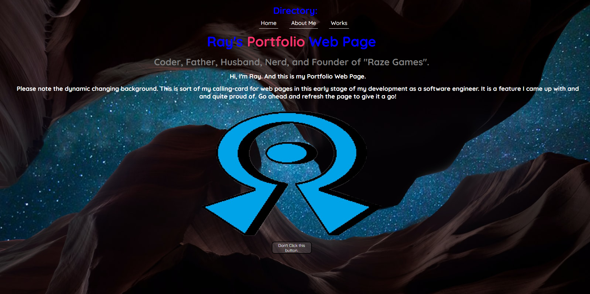
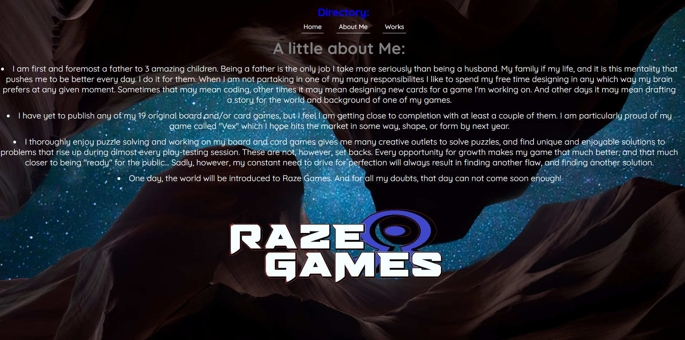
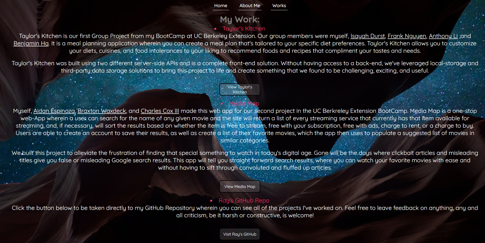

# Portfolio, but with ```React``` this time!

## Description

This project was bootstrapped with [Create React App](https://github.com/facebook/create-react-app).

## Table of Contents

- [Installation](#installation)
- [Usage](#usage)
- [Credits](#credits)
- [License](#license)
- [Contact Me](#ContactMe)

## Installation

### `npm run start`

Runs the app in the development mode.\
Open [http://localhost:3000](http://localhost:3000) to view it in your browser.

## Usage

To use this repo, go to the repo and clone the files, then open the cloned files in VS Code, be sure you’re in the correct directory in your terminal, then type "npm install" wait a moment for it to finsih, then type "npm run start" in your command line. You may need to run a build first, simply type "npm run build" before typing "npm run start" in your command line.


--

--



## Credits

Collaborators:
I built this web page myself using React and following various YouTube tutorials for certain features, and a little help from google. 

## License

MIT License

Copyright (c) [year] [Raymond Robinson]

Permission is hereby granted, free of charge, to any person obtaining a copy
of this software and associated documentation files (the "Software"), to deal
in the Software without restriction, including without limitation the rights
to use, copy, modify, merge, publish, distribute, sublicense, and/or sell
copies of the Software, and to permit persons to whom the Software is
furnished to do so, subject to the following conditions:

The above copyright notice and this permission notice shall be included in all
copies or substantial portions of the Software.

THE SOFTWARE IS PROVIDED "AS IS", WITHOUT WARRANTY OF ANY KIND, EXPRESS OR
IMPLIED, INCLUDING BUT NOT LIMITED TO THE WARRANTIES OF MERCHANTABILITY,
FITNESS FOR A PARTICULAR PURPOSE AND NONINFRINGEMENT. IN NO EVENT SHALL THE
AUTHORS OR COPYRIGHT HOLDERS BE LIABLE FOR ANY CLAIM, DAMAGES OR OTHER
LIABILITY, WHETHER IN AN ACTION OF CONTRACT, TORT OR OTHERWISE, ARISING FROM,
OUT OF OR IN CONNECTION WITH THE SOFTWARE OR THE USE OR OTHER DEALINGS IN THE
SOFTWARE.

---
## ContactMe

- Ray Robinson @ https://Github.com/RayR124 or email me at RealtorRayR@Gmail.com if you have any comments, thoughts, or suggestions.